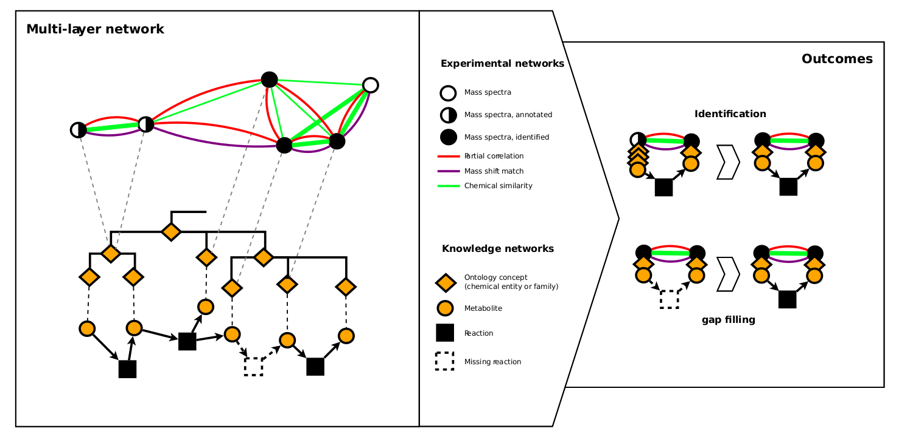

<h1 id="MCNproject" style="text-align: justify">MetClassnet Project</h1>
 
<h2 id="MCNproject" style="text-align: justify">New approaches to bridge the gap between genome-scale metabolic networks and untargeted metabolomics</h2>
 

 Metabolism is a key biological process which is modulated in living organisms in response to environmental exposure, genetic variations and diet. Understanding metabolism is essential to improve plant performance, nutritional content, and to understand Human health and well-being. The metabolic response can be complex, involving hundreds to thousands of small molecules (metabolites) connected by thousands of biochemical reactions. Together, they constitute a dense network, in its entirety often called Genome Scale Metabolic Network (GSMN). Within this context, metabolomics is a cornerstone approach to experimentally observe changes in the metabolome (set of metabolites). 
   

One of the main analytical platforms to measure the metabolome is Mass Spectrometry (MS) which is often coupled to separation methods (e.g. Liquid Chromatography, LC-MS). Even though the technology is advancing rapidly, several challenges remain for widespread adoption of metabolomics. Metabolite identification remains one of these challenges. 
    

Nevertheless, experimentally obtained data and in silico generated GSMN overlap only partially and are generally not studied simultaneously. In MetClassNet, we hypothesis that these difficulties could be overcome by designing new data structures and algorithms which will exploit the connectivity (network) between molecules. This integrative approach will boost the power of data analysis by unifying GSMNs and networks obtained from experimental data.  
   

Hence, MetClassNet will propose a new computational framework and novel methods to help with tackling main metabolomics challenges in data analysis and data interpretation. This framework will integrate information from experimentally derived information and GSMNs by bridging them using direct mapping, ontologies and chemical class information. 
   

At the end of the project, MetClassNet will offer the community an innovative tool set where it will be possible to go beyond table based analysis of metabolomics data by integrating (and not just exporting) them into a network system. To this end, MetClassNet will create novel algorithms and tools to mine these networks allowing to increase our knowledge of the metabolome. The developed framework will also ease the connection between metabolomics and GSMNs, hence allowing to fill the gaps in current databases of metabolic networks. Within MetClassNet project, we will showcase the benefit of the computational framework to address the study of metabolic modulations related to ageing, toxicology, cancer and nutrition. Finally, MetClassNet consortium will put the necessity of opening data, protocols and software to the community high in its agenda.  
   

<h2 id="MCNproject" style="text-align: justify">MetClassNet will propose new solutions to:</h2>

* Identify the unknowns

* Fill the gap in existing knowledge

 

<h2 id="MCNproject" style="text-align: justify">MetClassNet overall objectives:</h2>

* Develop a novel computational framework to build multilayer networks

* Develop state of art computational solutions exploiting the multilayer topology to
improve the power of metabolism analysis

* Generate new biological insight by using combined power of the above approaches.

* Liberate the new software solutions and data toward the community.
 

